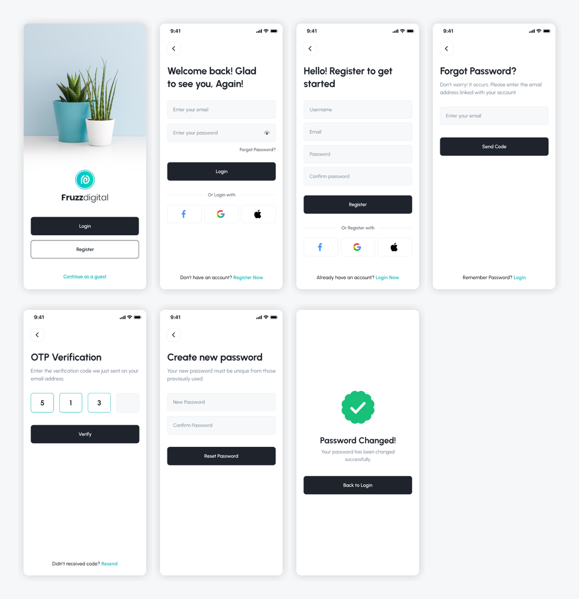

# Flutter Authentication System 🔐

A complete authentication UI system built with Flutter.

I created this project to practice building a real-world authentication
flow in Flutter. Instead of focusing on just one screen, I designed
the complete user journey, from welcoming users to changing their password.

The project includes clean layouts, form fields, reusable buttons,
and multiple screens connected through navigation.

## 📱 Project Preview

  

## ✨ What's Inside?

This project covers the main screens of an authentication system:

- Welcome Screen
- Login Screen
- Register Screen
- Forgot Password
- OTP Verification
- Create New Password
- Password Changed

Each screen is designed with a simple and consistent UI
to create a smooth experience for users.

## 🛠️ Built With

- Flutter
- Dart
- TextField
- TextFormField
- Form Validation
- Custom UI Components
- Flutter Navigation

## 💡 What I Focused On

While building this project, I focused on more than just creating
the screens.

I worked on:

- Creating clean and consistent UI layouts
- Using TextField and TextFormField for user input
- Working with buttons and form interactions
- Connecting multiple screens through navigation
- Building reusable UI components
- Understanding how authentication flows are structured

## 🔄 Authentication Flow

The project follows a simple authentication journey:

Welcome → Login / Register

Forgot Password → OTP Verification

OTP Verification → Create New Password

Create New Password → Password Changed

This flow helped me understand how different screens
work together in a complete user experience.

## 🎯 Why I Built This

I built this project as part of my Flutter learning journey.

My goal was to move beyond basic UI screens and practice
building a more complete application structure.

Projects like this help me improve my understanding of
Flutter widgets, user input, navigation, and UI development.

## 🚀 Future Improvements

I plan to improve this project by adding:

- Backend authentication
- Real OTP verification
- Stronger form validation
- Better error handling
- Secure user authentication

GitHub: https://github.com/hamza-hafeez-dev

LinkedIn: YOUR_LINKEDIN_URL
